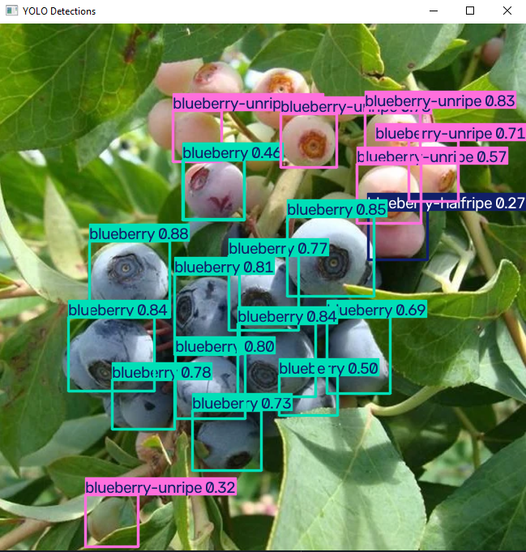

# fruitDataset
yolo26n model trained to detect different fruits

to be deployed to a robot which will work in agriculture
 
 
 

Guide:
- **detectionInputs:**  &nbsp;&nbsp;&nbsp;&nbsp;&nbsp;&nbsp;folder for images to run detecetion on
- **detectionOutputs:**  &nbsp;&nbsp;&nbsp;folder where annotated images (detection ran on them) go
- **images:**  &nbsp;&nbsp;&nbsp;&nbsp;&nbsp;&nbsp;&nbsp;&nbsp;&nbsp;&nbsp;&nbsp;&nbsp;&nbsp;&nbsp;&nbsp;&nbsp;&nbsp;&nbsp;&nbsp;&nbsp;folder with train and val images
- **labels:**  &nbsp;&nbsp;&nbsp;&nbsp;&nbsp;&nbsp;&nbsp;&nbsp;&nbsp;&nbsp;&nbsp;&nbsp;&nbsp;&nbsp;&nbsp;&nbsp;&nbsp;&nbsp;&nbsp;&nbsp;&nbsp;&nbsp;folder with train and val labels
- **roboFLOWING:**  &nbsp;&nbsp;&nbsp;&nbsp;&nbsp;&nbsp;&nbsp;folder holding unused files from Roboflow database
- **runs:**  &nbsp;&nbsp;&nbsp;&nbsp;&nbsp;&nbsp;&nbsp;&nbsp;&nbsp;&nbsp;&nbsp;&nbsp;&nbsp;&nbsp;&nbsp;&nbsp;&nbsp;&nbsp;&nbsp;&nbsp;&nbsp;&nbsp;&nbsp;&nbsp;folder holding the yolo models and training results
- **.gitattributes:**  &nbsp;&nbsp;&nbsp;&nbsp;&nbsp;&nbsp;&nbsp;&nbsp;&nbsp;&nbsp;:scared:
- **README.md:**  &nbsp;&nbsp;&nbsp;&nbsp;&nbsp;&nbsp;&nbsp;&nbsp;&nbsp;&nbsp;&nbsp;you are here
- **dataset.yaml:**  &nbsp;&nbsp;&nbsp;&nbsp;&nbsp;&nbsp;&nbsp;&nbsp;&nbsp;&nbsp;file to tell the yolo model all about it
- **fruitFirmness.json:** &nbsp;&nbsp;WIP
- **imageDetec.py:**  &nbsp;&nbsp;&nbsp;&nbsp;&nbsp;&nbsp;&nbsp;python file that runs the image detection on selected image from detectionInputs
- **training.py:**  &nbsp;&nbsp;&nbsp;&nbsp;&nbsp;&nbsp;&nbsp;&nbsp;&nbsp;&nbsp;&nbsp;&nbsp;&nbsp;&nbsp;python file to run training on the model

 
 
 
To pick fruits, robot needs to know what fruit it is

to know how it should pick the fruit up to avoid crushing it

- [x] Make yolo model to detect when there is a fruit and what kind of fruit
- [ ] Create database holding info of how to pick up each type of fruit
- [ ] Train a quadrupedal robot in sim how to pick up fruits
- [ ] Get a physical robot and apply yolo model, database, and sim training
