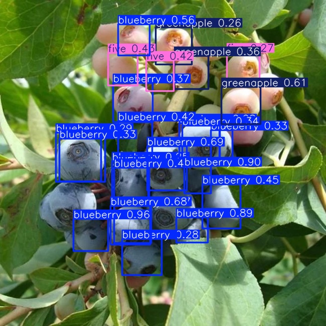

# fruitDataset
yolo26n model trained to detect different fruits

to be deployed to a robot which will work in agriculture

-

To pick fruits, robot needs to know what fruit it is

to know how it should pick the fruit up to avoid crushing it

- [x] Make yolo model to detect when there is a fruit and what kind of fruit
- [ ] Create database holding info of how to pick up each type of fruit
- [ ] Train a quadrupedal robot in sim how to pick up fruits
- [ ] Get a physical robot and apply yolo model, database, and sim training
